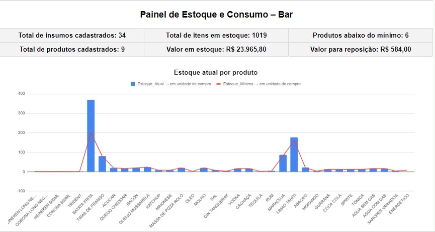
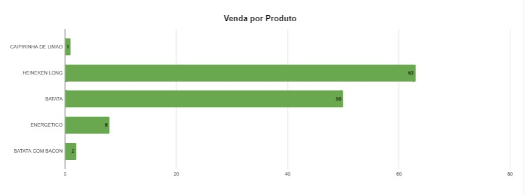
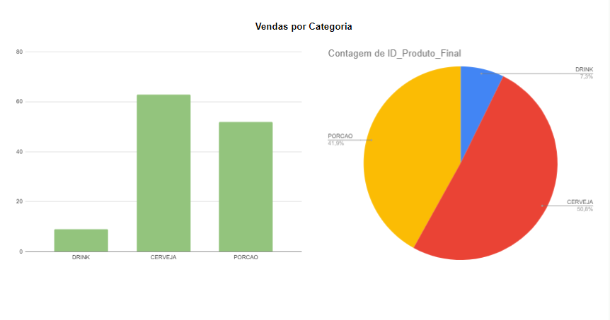

# Painel de Estoque e Consumo para Bar

Projeto desenvolvido para apoiar o controle de estoque, consumo e reposição de insumos em um bar, utilizando Google Sheets como painel de visualização e acompanhamento gerencial.

## Sobre o projeto

Atualmente, o sistema funciona com cadastro e atualização manual dos dados diretamente na planilha.

A proposta do projeto é organizar informações operacionais em um painel visual, facilitando o acompanhamento de estoque, produtos cadastrados, itens abaixo do mínimo e necessidade de reposição.

## Funcionalidades atuais

- Visualização de indicadores gerais de estoque
- Controle de insumos cadastrados
- Controle de produtos cadastrados
- Acompanhamento de itens em estoque
- Identificação de produtos abaixo do estoque mínimo
- Cálculo de valor total em estoque
- Cálculo de valor estimado para reposição
- Relatório visual de vendas por categoria

## Tecnologias utilizadas

- Google Sheets
- JavaScript
- Python (em implementação)

## Situação atual

No estágio atual do projeto:

- O cadastro de produtos e insumos é feito manualmente na planilha
- A planilha é utilizada como painel de visualização e relatório
- Parte da lógica complementar pode ser apoiada por JavaScript
- A evolução do projeto prevê automações em Python

## Estrutura inicial do projeto

```text
painel-estoque-consumo-bar/
├── README.md
├── .gitignore
├── requirements.txt
├── src/
├── data/
└── docs/
```

## Próximas implementações

- [ ] Criar cadastro de produtos via Python
- [ ] Criar cadastro de insumos via Python
- [ ] Implementar lançamento de compra de insumos via Python
- [ ] Implementar lançamento de vendas via Python
- [ ] Criar controle de desperdícios
- [ ] Transformar a planilha em uma camada apenas de visualização e relatório

## Objetivo

O objetivo deste projeto é aplicar tecnologia em uma necessidade real de gestão de bar, organizando dados de estoque e consumo para apoiar decisões operacionais e gerenciais.

## Capturas de tela

### Painel geral



### Indicadores principais



### Relatórios visuais



## Como continuar no VS Code

1. Clone o repositório na sua máquina.
2. Abra a pasta no VS Code.
3. Crie e ative um ambiente virtual Python.
4. Instale as dependências com `pip install -r requirements.txt`.
5. Desenvolva os módulos Python dentro da pasta `src/`.

## Aprendizados

Durante o desenvolvimento deste projeto, foram trabalhados conceitos como:

- Organização de dados
- Estruturação de indicadores
- Controle de estoque
- Visualização de informações gerenciais
- Aplicação prática de tecnologia em um contexto real

## Autor

Desenvolvido por Lucas Boelter.
